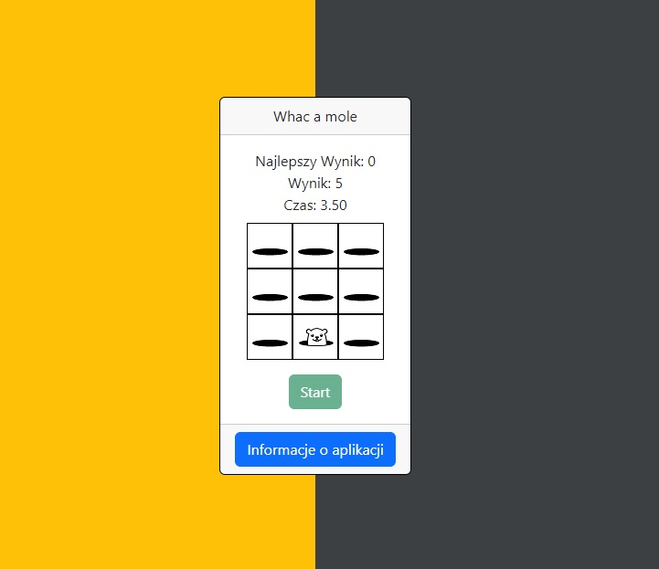

# :desktop_computer: WhacAMole

The application displays a 3x3 grid and randomly places a mole on it. When the user clicks on the mole, the application randomly selects a new location for the mole and places it there. The user's task is to click on the moles as quickly as possible. For each click, the user receives an additional 0.5 seconds of time and 1 point. When the time runs out, the game ends and the score is recorded.

## :framed_picture: Screenshots

## :joystick: Demo

https://kamilkeder.github.io/WhacAMole/

## :e-mail: Feedback

If you have any feedback, please reach out to me at kontaktkkeder@gmail.com
